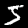

___WORK IN PROGRESS___

# Prologue

## The Sharpened Cosine Transform

The Sharpened Cosine Transform is a modified form of cosine transform that showed over the past few months, after Brandon Rohrer thought it up.

[https://www.rpisoni.dev/posts/cossim-convolution/]()
[https://www.rpisoni.dev/posts/cossim-convolution-part2/]()

The usual cosine transform 

$$scs(s, k) = \frac{s \cdot k}{\Vert{s}\Vert \Vert{k} \Vert}$$ 

is modified It looks like

$$scs(s, k) = sign(s \cdot k)\Biggl(\frac{s \cdot k}{(\Vert{s}\Vert + q)(\Vert{k}\Vert + q)}\Biggr)^p$$

## How does it work?

2 Parameters are introduced: 

- $q$ to floor the value of the norm of either vector;
- $p$ an exponentiation factor to decide 

Let's imagine the case of a picture. Some zones might contain a lot of information (e.g. an airplane); some just noise (e.g. various shades of blue in the background).

### Ignore the irrelevant

When running a convolution over the picture, and under the assumption that the entire picture has been normalised, the norm of a patch around the plane will be higher that over the sky. But, when it comes to apply the cosine transform, those local vectors will be renormalised to 1. The effect is that the the convolution filters will be trained to find information assuming that each of those 2 zones are of equal relevance. 

The $q$ parameter helps. Over a patch of sky, $q$ will be much higher than $\Vert{s}\Vert$. Therefore the value of the convolution will be seriously decreased. 

No training budget will be wasted on training on the useless. $q$ clips the noise out.

### Focus on anything even remotely interesting, or only zoom in the critical

The $p$ exponentiation parameters could be anything from $0^+$ to $+\infty$.

If $p = 1$, we have the normal cosine distance. 

If $p > 1$, we have a convex function. At the extreme, we have a curve that is almost $0$ almost everywhere until the cosine distance becomes close to $1$. __If $p > 1$, we only look at the truely interesting patches__. __$p > 1$ is super sensitivity__ 

Conversely, if $p < 1$, we get a concave curve. For very low (positive) values of $p$, the curve will be close to $1$ everywhere until the cosine distance gets close to $0$. __If $p \rightarrow 0$, the truely useless is ignored, anything else is worth considering__. __$p \rightarrow 0$ is super specificity__.

(P.S. despite decades of exposure to those words, I still reach out to a dictionary to know specificity vs.sensitivity. Intuition A+. Vocabulary. Z-)


## How to improve?

A few improvements, some implemented in the code, some not.

### Keep $p$ reasonable (implemented)

Instead of using a parameter $p$, use a _Soft ReLU_ shape:

$$scs(s, k) = sign(s \cdot k)\Biggl(\frac{s \cdot k}{(\Vert{s}\Vert + q)(\Vert{k}\Vert + q)}\Biggr)^ {\log \left( 1 + \exp \left( p \right) \right) }$$

$p$ can now range from $-\infty$ to $+\infty$ with the highest gradients around 0, i.e. around an exponent of 1.


### Get rid of the cosine transform and go for a real Pearson cross-correlation  (implemented)

Cosine distance is great for embeddings. But for determining similarities, not so much. Let's go for a true cross-correlation.

$$S = \sum{s - \bar{s}}$$
$$K = \sum{k - \bar{k}}$$

$$scs(s, k) = sign(S \times K))\Biggl(\frac{S \times K}{\left( \sqrt{(\sum{s - \bar{s})^2}} + q \right) \cdot \left( \sqrt{(\sum{k - \bar{k})^2}} + q \right)}\Biggr)^ {\log \left( 1 + \exp \left( p \right) \right) }
$$


A bit more of a mouthful and would translate into a dog's breakfast in TensorFlow...


### Robustify (not implemented)

$q$ brings noise removal. But the cross-correlation is still sensitive to outliers. Clipping for example at σ = 2 (Winsorised correlation) after re-normalisation, Spearman or one of myriad other variants with different performance profiles. 

### Use actual information content as the norm  (not implemented)

When the Salvator Mundi was put on the market a couple of years ago (and eventually bought for half a billion US), numerous methods were used to confirm its authenticity. An interesting approach came from an AI company that had aplly a similar method to Rembrandt's. See [https://www.art-critique.com/en/2019/04/a-eye-another-tool-for-the-authenticating-artworks/](), on Arxiv [https://arxiv.org/abs/2005.10600]() for a (hardly) little more technical content on Salvator Mundi work, this [https://arxiv.org/abs/1907.12436]() for a bit more, and the code at [https://github.com/stevenjayfrank/A-Eye]().

Key to their method method is to focus the training and inference on sections of the painting where the information content is high.

This could be use to replace the $q$ parameter.


# Show me the __Julia__ code

Many have contributed TensorFlow and PyTorch implementations. See [https://e2eml.school/scs.html]().

Time for some Julia supremacy with the [https://fluxml.ai/](Flux.jl) library. Code is in the repo. Running under Julia 1.7, packages upgraded to the latest versions.


## Using the MNIST dataset


```julia
cd("."); using Revise, Pkg; Pkg.activate(".")
```

      Activating project at `~/Development/julia/projects/SharpenedCorrelation`


```julia
using ProgressMeter, BenchmarkTools
using Flux, MLDatasets, ImageCore
```

We here only use the MNIST dataset described in [https://juliaml.github.io/MLDatasets.jl/stable](). If not already available in `~/.julia/datadeps/`, it will be automatically downloaded. Some `MLDataSets` request accepting the terms of use. If a prompt appears, type `y` + `Enter`.

Let's just check that we see something.

(To download for example `MNIST` separately: `MNIST.download(; i_accept_the_terms_of_use=true)`)


```julia
MNIST.convert2image(MNIST.traintensor(1))
```


    

    


```julia
MNIST.trainlabels(1)
```


    5


```julia
size(MNIST.testtensor())
```


    (28, 28, 10000)


```julia
# Let's use global variables to easily use other datasets
WIDTH, HEIGHT, N_TRAIN_SAMPLE = size(MNIST.traintensor());
_, _, N_TEST_SAMPLE = size(MNIST.testtensor());
N_CHANNELS = 1;
```

Flux helps with the data loaders.


```julia
train_x, train_y = MNIST.traindata(Float32);
test_x, test_y = MNIST.testdata(Float32);
```


```julia
# Insert a channel dimension for the MNIST dataset
train_x = reshape(train_x, WIDTH, HEIGHT, N_CHANNELS, N_TRAIN_SAMPLE);
test_x = reshape(test_x, WIDTH, HEIGHT, N_CHANNELS, N_TEST_SAMPLE);

# reencode the labels as One-Hot
train_y, test_y = Flux.onehotbatch(train_y, 0:9), Flux.onehotbatch(test_y, 0:9);
```

`train_x` and `train_y` are functions that deliver the data. They are combined into a data loader.


```julia
# Create DataLoaders (mini-batch iterators)
BATCH_SIZE = 256;
train_loader = Flux.DataLoader((data=train_x, label=train_y), batchsize=BATCH_SIZE, shuffle=true);
test_loader = Flux.DataLoader((data=test_x, label=test_y), batchsize=BATCH_SIZE, shuffle=false);
```

## Sharpened Cross-correlation Similarity

Let's start building the layers


```julia
using SharpenedCorrelation
```

    ┌ Info: Precompiling SharpenedCorrelation [44fb963a-1088-41e2-b5d8-086b29f0560c]
    └ @ Base loading.jl:1423


Let's create a single Sharpened Cosine Transform with a single B&W input channel yielding 8 output channels. The other 3 parameters are the kernel size, padding width around an image (padded at 0,0), and the stride. 

Setup all the relevant model variables with values (here are the default values taken from [https://github.com/brohrer/sharpened_cosine_similarity_torch/blob/main/demo_cifar10.py]()):

- Batch size: `batchsize = 1_024`
- Maximum learning rate:  `max_lr = 0.01`
- Number of classes: `n_classes = 10`
- Number of training epochs: `n_epochs = 100`
- Number of runs: `n_runs::Int = 1_000`

as well as description of the model layers.

`
block_params::Dict = Dict(1 => [3,  0, 0, 0, 0, 0],
                          2 => [16, 3, 2, 1, 2, 2],
                          3 => [24, 3, 2, 1, 2, 2],
                          4 => [48, 3, 2, 1, 2, 2])
`

Here, the model receives input described in layer 1, followed by 3 block layers of _Sharpened Cosine Similarity_ + _Batch Normalisation_ + _Maximum Absolute Pooling_, then followed by a final _linear_ layer (called `MultiDense` in the code) to generate the final classes. 

Each entry for a dual layer is of the format: `[n_out, scs_kernel, stride, scs_padding, width/height of the max pooling]`. For the input layer 1, the input channels are irrelevant, the layer only generates the input values.

Let's start with the smallest model possible, a single layer.


```julia
model_params = HyperParameters(;
    batchsize = BATCH_SIZE, 
    n_classes = size(train_y)[1], 
    n_epochs = 100, 
    n_runs = 500, 
    block_params = Dict(
        1 => [1,   0, 0, 0, 0], 
        2 => [24,  5, 2, 1, 8]))

```


    HyperParameters(256, 10, 100, 500, 0.01f0, Dict(2 => [24, 5, 2, 1, 8], 1 => [1, 0, 0, 0, 0]))


We create a full model.


```julia
sc = SharpenedCorrelationModel(model_params, WIDTH, HEIGHT)
```

    Creating block with output dimension of the SC layer:
    width in = 28 x height in 28
    channels in 1 - out channels 24
    
    


    SharpenedCorrelationModel(Chain(SharpenedConvolution
      W: Array{Float32}((5, 5, 1, 24)) [0.04638807 0.0047254674 … 0.017689139 0.086096235; 0.08499048 -0.0613958 … 0.058118477 -0.0904223; … ; -0.010184385 0.03848715 … -0.09096578 0.031015009; 0.06442948 -0.04776862 … 0.08694374 0.059556026;;;; 0.0015607036 0.0013676904 … -0.017603511 0.09542351; -0.034103982 -0.037440486 … 0.083852306 -0.03049882; … ; 0.008955512 0.07825604 … 0.07592934 0.04848927; -0.037743457 0.00084553246 … -0.062126834 -0.0383248;;;; 0.06936917 0.00065225054 … 0.024836259 0.05525006; -0.074202575 -0.056454882 … 0.01357371 0.06303288; … ; -0.06086013 0.08398753 … -0.09124168 0.07614561; -0.08278241 0.07367305 … 0.07217062 0.002183532;;;; … ;;;; -0.041048124 -0.0686003 … -0.058127005 0.07097752; -0.09031009 0.051736716 … 0.0060459236 0.07552114; … ; -0.060251903 -0.009492994 … -0.0810663 0.0376221; -0.07273941 -0.014391 … -0.0073639033 -0.0025527743;;;; 0.009745646 -0.055214845 … 0.097838506 -0.015237818; 0.004335867 0.076558255 … 0.07234697 0.021624133; … ; 0.010847977 -0.08530224 … -0.06170724 -0.036352582; -0.011879912 -0.06326131 … 0.08724105 -0.053053424;;;; 0.023053179 -0.04926681 … -0.05389427 0.036552172; -0.05292944 0.04216098 … 0.0019279486 -0.06383042; … ; -0.0568371 -0.054360483 … 0.05934945 -0.055544186; 0.058866527 0.09666495 … -0.048075993 -0.078556836]
      p: Float32 0.0f0
      q: Float32 0.1f0
      kernel: Int64 5
      stride: Int64 2
      padding: Int64 1
      out_width: Int64 13
      out_height: Int64 13
      out_chan: Int64 24
    , BatchNorm(24), AdaptiveMaxPool((8, 8)), flatten, Dense(1536, 10)), HyperParameters(256, 10, 100, 500, 0.01f0, Dict(2 => [24, 5, 2, 1, 8], 1 => [1, 0, 0, 0, 0])), 28, 28)


A Flux layer expects the following input dimension: `width` x `height` x `channels` x `batch size`. There for we need to reshape an image before checking that the layer actually works.


```julia
# Check it works on single image
img = @btime train_x[:, :, 1:1, 1:1]
size(img)
```

      1.477 μs (7 allocations: 3.45 KiB)


    (28, 28, 1, 1)


```julia
# Let's check it doesn't bug out on a single image. Size should be n classes x batch size (here 1)
@time size(sc(img))
```

      0.000903 seconds (3.95 k allocations: 301.359 KiB)


    (10, 1)


## Loss function and optimiser


```julia
function loss_and_accuracy(data_loader, model, device)
    accuracy = 0
    loss = 0.0f0
    count = 0
    for (x, y) in data_loader
        x, y = device(x), device(y)
        ŷ = model(x)
        loss += Flux.Losses.logitcrossentropy(ŷ, y, agg=sum)
        accuracy += sum(onecold(ŷ) .== onecold(y))
        count +=  size(x)[end]
    end
    return loss / count, accuracy / count
end
```


    loss_and_accuracy (generic function with 1 method)


```julia
optimiser = ADAM(model_params.max_lr);
ps = Flux.params(sc);
```

## Training


```julia
# Work in progress.

## Training
# @showprogress for epoch in 1:model_params.n_epochs
@showprogress for epoch in 1:2
    for (data, label) in train_loader
        # Transfer data to device - Uncomment to use automatic detection in the package
        # data, label = SCS.Training_Device(data), SCS.Training_Device(label) 
        
        # Compute gradient
        gs = gradient(() -> Flux.Losses.logitcrossentropy(sc(data), label), ps) 
        Flux.Optimise.update!(optimiser, ps, gs) # update parameters
    end

    # Report on train and test
    train_loss, train_acc = loss_and_accuracy(train_loader, scs, SCS.Training_Device)
    test_loss, test_acc = loss_and_accuracy(test_loader, scs_model, SCS.Training_Device)
    println("Epoch: $(epoch) / $(model_params.n_epochs)")
    println("  train_loss = $(train_loss), train_accuracy = $(train_acc)")
    println("  test_loss = $(test_loss), test_accuracy = $(test_acc)")
end

```


    Mutating arrays is not supported -- called setindex!(::Array{Float32, 4}, _...)

    

    Stacktrace:

      [1] error(s::String)

        @ Base ./error.jl:33

      [2] (::Zygote.var"#442#443"{Array{Float32, 4}})(#unused#::Nothing)

        @ Zygote ~/.julia/packages/Zygote/cCyLF/src/lib/array.jl:71

      [3] (::Zygote.var"#2341#back#444"{Zygote.var"#442#443"{Array{Float32, 4}}})(Δ::Nothing)

        @ Zygote ~/.julia/packages/ZygoteRules/AIbCs/src/adjoint.jl:67

      [4] Pullback

        @ ~/Development/julia/projects/SharpenedCorrelation/src/model.jl:129 [inlined]

      [5] (::typeof(∂(λ)))(Δ::Array{Float32, 4})

        @ Zygote ~/.julia/packages/Zygote/cCyLF/src/compiler/interface2.jl:0

      [6] Pullback

        @ ~/.julia/packages/Flux/qAdFM/src/layers/basic.jl:47 [inlined]

      [7] (::typeof(∂(applychain)))(Δ::Matrix{Float32})

        @ Zygote ~/.julia/packages/Zygote/cCyLF/src/compiler/interface2.jl:0

      [8] Pullback

        @ ~/.julia/packages/Flux/qAdFM/src/layers/basic.jl:49 [inlined]

      [9] (::typeof(∂(λ)))(Δ::Matrix{Float32})

        @ Zygote ~/.julia/packages/Zygote/cCyLF/src/compiler/interface2.jl:0

     [10] Pullback

        @ ~/Development/julia/projects/SharpenedCorrelation/src/model.jl:198 [inlined]

     [11] (::typeof(∂(λ)))(Δ::Matrix{Float32})

        @ Zygote ~/.julia/packages/Zygote/cCyLF/src/compiler/interface2.jl:0

     [12] Pullback

        @ ./In[22]:11 [inlined]

     [13] (::typeof(∂(λ)))(Δ::Float32)

        @ Zygote ~/.julia/packages/Zygote/cCyLF/src/compiler/interface2.jl:0

     [14] (::Zygote.var"#94#95"{Zygote.Params, typeof(∂(λ)), Zygote.Context})(Δ::Float32)

        @ Zygote ~/.julia/packages/Zygote/cCyLF/src/compiler/interface.jl:357

     [15] gradient(f::Function, args::Zygote.Params)

        @ Zygote ~/.julia/packages/Zygote/cCyLF/src/compiler/interface.jl:76

     [16] macro expansion

        @ In[22]:11 [inlined]

     [17] top-level scope

        @ ~/.julia/packages/ProgressMeter/Vf8un/src/ProgressMeter.jl:940

     [18] eval

        @ ./boot.jl:373 [inlined]

     [19] include_string(mapexpr::typeof(REPL.softscope), mod::Module, code::String, filename::String)

        @ Base ./loading.jl:1196

